# How to use CG Arena

## Table of contents

- [Creating a new arena](#creating-a-new-arena)
- [Configuring the arena](#configuring-the-arena)
- [Running the arena](#running-the-arena)
- [Bots](#bots)
    - [Submitting a new bot](#submitting-a-new-bot)
    - [Renaming the bot](#renaming-the-bot)
    - [Deleting the bot](#deleting-the-bot)
    - [Checking the bot source code](#checking-the-bot-source-code)
- [Leaderboards](#leaderboards)
    - [Global leaderboard](#global-leaderboard)
    - [Custom leaderboards](#custom-leaderboards)
    - [Creating a custom leaderboard](#creating-a-custom-leaderboard)
    - [Changing the custom leaderboard](#changing-the-custom-leaderboard)
    - [Deleting the custom leaderboard](#deleting-the-custom-leaderboard)
    - [Checking the match seeds](#checking-the-match-seeds)
- [Charts](#charts)
- [Misc](#misc)
    - [Deleting the old matches](#deleting-the-old-matches)
    - [Changing the color theme](#changing-the-color-theme)
- [Troubleshooting]()

## Creating a new arena

You can create a new arena using the following command:

```sh
# Create an arena in the current folder
cgarena init

# Or create an arena in a new folder
cgarena init summer-challenge-2025
cd summer-challenge-2025
```

## Configuring the arena

The `cgarena init` command generates multiple files in the folder:

- `cgarena_config.toml` - CG Arena config file with the default config.
- `play_game.py` - python script for running matches (expects [brutaltester-compatible](making_bt_compatible_referee.md) `referee.jar` in the same folder to work)
- `build.sh` - generic script CG Arena uses to build submitted bots (supports c++ and python out of the box)
- `run.sh` - generic script CG Arena uses to run bots (supports c++ and python out of the box)

The default config file is documented, so read through it and make any necessary changes. Be sure to restart the arena after modifying the configuration.

The important params to configure:
- `[game]`
    - `min_players`: min amount of bots per match
    - `max_players`: max amount of bots per match 
    - `symmetric`: whether the game is symmetric
- `[[workers]]`
    - `threads`: amount of concurrent matches to run (don't set higher than amount of cpu threads you have)

Refer to [this document](configuration.md) for complete configuration options.

## Running the arena

To start the arena, use:

```sh
# Run the arena in the current folder
cgarena run

# Or run the arena in a specific folder
cgarena run summer-challenge-2025
```

Example output:

```sh
> cgarena run
CG Arena started, press Ctrl+C to stop it
Local:   http://localhost:1234/
Network: use 'server.expose' config param to expose
```

Open the **Local** URL in your browser to access the web UI.

The arena should initially look like this:

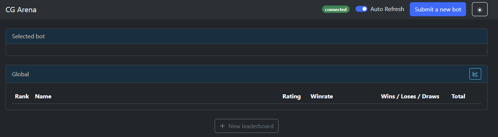

The UI theme (light or dark) is selected based on your operating system settings.

## Bots

### Submitting a new bot

To submit a new bot, click "Submit a new bot" button in the top right corner:

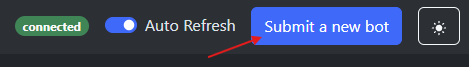

A modal will appear where you would need to input:

- Bot name
    - Must be unique (can be changed later)
- Source code file
    - Max size: 100,000 characters (same as CG)
- Language
    - Used for `cmd_*` commands only

Once submitted (and assuming the arena is properly configured—especially `cmd_build`), the UI should look like this:

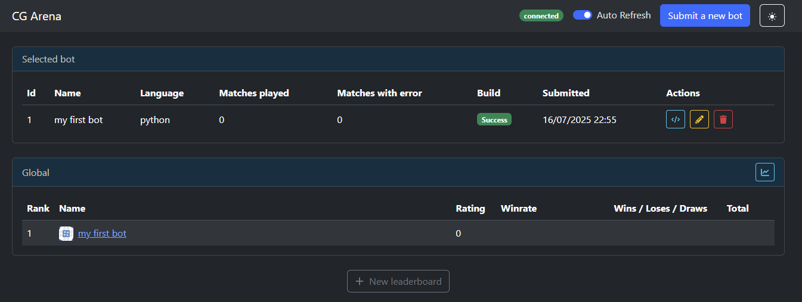

Note the "Selected bot" caption—CG Arena always keeps one bot selected (if any exist) to make leaderboard comparisons easier.

If the bot fails to build, you'll see:

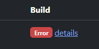

Click "details" to investigate the issue.

### Renaming the bot

Click the pencil icon in the "Actions" column to rename a bot:

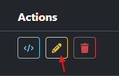

Renaming has no effect on functionality—bots are referenced internally by ID.

### Deleting the bot

Click the trash icon in the "Actions" column:

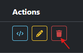

Deleting the bot will trigger recalculation of all the leaderboards.

### Checking the bot source code

You can check your bot's source code by clicking on the "code" icon in the "Actions" column:

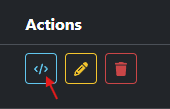

## Leaderboards

### Global leaderboard

Once enough bots are submitted (at least `game.min_players`), matchmaking begins and the global leaderboard will show rankings based on **all** finished matches.

Here is an example of a global leaderboard in the middle of the contest:

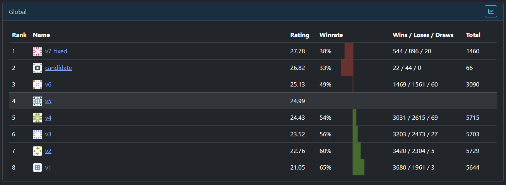

You can see the row with bot named "v5" is highlighted. Highlighted bot is compared to other bots. You can highlight any bot by clicking on bot's name. 

The leaderboard has the following columns:

- Rank - 1st means strongest
- Name - bot name
- Rating - skill rating (hover to see more details, e.g. `mu` and `sigma`)
- Winrate - winrate of highlighted bot vs the current bot
    - Background color shows winrate too (green > 50%, red < 50%)
- Wins / Loses / Draws - match stats where both highlighted and current bot participated
- Total - total amount of matches where both highlighted and current bot participated


### Custom leaderboards

Sometimes you want to check the leaderboard for the matches grouped by some criteria like:

- only 2-player matches
- only 3-player matches
- matches where bot "candidate" was the 1st player
- matches with small maps

For this purpose CG Arena has "custom leaderboards" feature. Basically, you can create leaderboards based on filtered matches.

### Creating a custom leaderboard

You can create a custom leaderboard using "New leaderboard" button at the bottom of the screen:

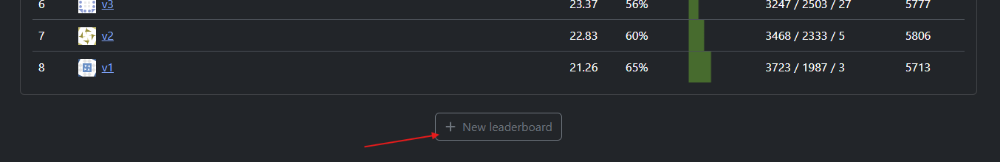

The modal would appear where you need to input:

- Leaderboard name - just for your reference, e.g. "small maps", can be changed later
- Match filter - more details [here](match_attributes_and_filters.md#match-filters)

Once you input all the data and press "Create", the new custom leaderboard will be created, e.g:

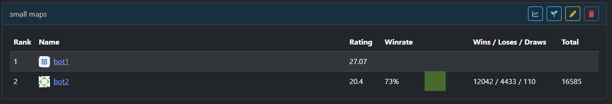

You can hover leaderboard name to see the match filter and the amount of matches matching the filter.

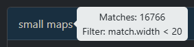

### Changing the custom leaderboard

You can edit the custom leaderboard by clicking on the "pencil" icon on the right side of the leaderboard header:

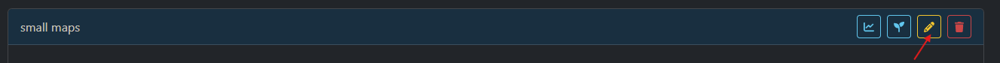

Changing the match filter would trigger recalculation of the target leaderboard.

### Deleting the custom leaderboard

You can delete the custom leaderboard by clicking on the "trash" icon on the right side of the leaderboard header:

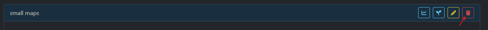

### Checking the match seeds

You can check some example seeds of the matches used by the custom leaderboard by clicking on the "seed" icon on the right side of the leaderboard header:

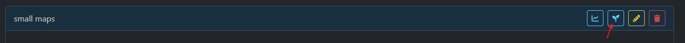

It would display the seeds of the last 10 matches used by the leaderboard. New matches that fit the filter will yield new seeds.

## Charts

If your bot has emitted some turn data (please check [this doc](match_attributes_and_filters.md#emitting-match-attributes) for details on emitting data from bots), you can visualize it on a chart.

You can the data by clicking "chart" icon on any of the leaderboards:

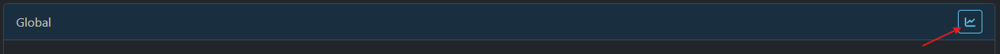


The modal would appear where you would need to input:

- Bot turn attribute name, e.g. "score" (no quotes). This attribute should be emitted by your bot.
- Match filter - same as when creating the leaderboard. In fact, the leaderboard on which you clicked on "chart" icon would be used to set initial match filter value.

Once all the data was inputted you can press "Visualize". You should see something like this:

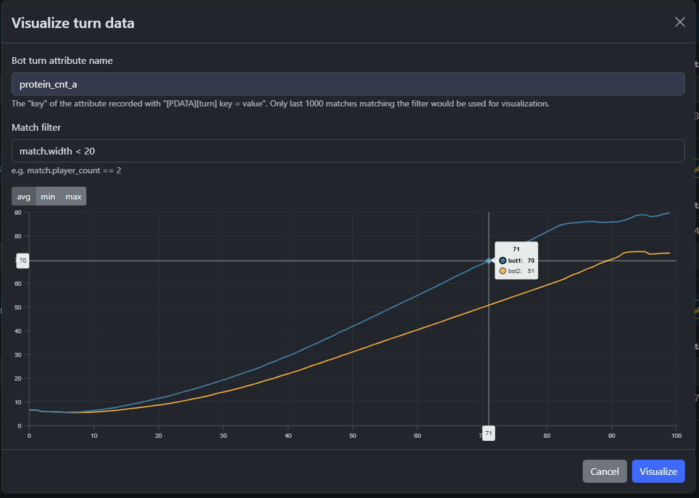

The chart has the following structure:

- x-axis: turn
- y-axis: aggregate (e.g. "avg") of the target metric on given turn among all the matches

You can also switch between "avg", "min" and "max" aggregate functions by using controls above the visualiation:

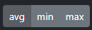

Note:

- only the last 1000 matches matching the filter are used to build the visualization
- charts are not persisted, so if you close the modal but want to check the same visualization, you would need to input all the fields again

## Misc

### Deleting the old matches

CG Arena stores all the data in SQLite (local `cgarena.db` file). This file can grow large over time, especially if your bots emit lots of data.

In order to clean up old matches you can use `wipe-old-matches` cli command, e.g:

```sh
# this would delete 25% of old matches
cgarena wipe-old-matches -p 25
```

Check `cgarena help` for more details.

### Changing the color scheme

CG Arena web ui supports light and dark themes.

You can toggle the theme using the button on the top right of the screen:

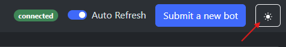

## Troubleshooting

### Bot processes are not terminated

If you see lots of bot processes hanging in RAM, that means they are not terminated properly.

This can happen if you are using intermediate scipt between referee and bot executables, e.g. `run.sh`.

Referee usually sends `SIGTERM` signall to bot processes to terminate the bots, but the default `run.sh` file does not propagate that termination to the bot.

Easy way to solve this is to **check for stdin EOF before reading the turn input**, e.g.

```c++
int turn = 0;
while (!std::cin.eof()) {
    turn++;
    // read turn data
}
```

Another way is to not use `run.sh` and embed `g++` call directly into `cmd_run` in your `cgarena_config.toml`.